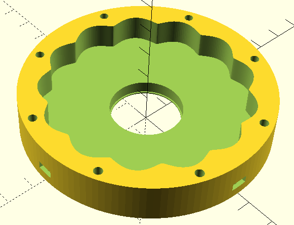

# vptc-calc
Калькулятор ВПТК

```
docker build -t vptc-calculator .
```

```
docker run --rm -it \
  -v "$(pwd)/calc-vpts.py":/app/calc-vpts.py:ro \
  -v "$(pwd)/output":/app/output \
  vptc-calculator
```

в папрку output помещается файл vptc-calc.scad который необходимо открыть в программе OpenScad.
Внизу, в секции "Сборка", перечисляются детали, можно их создание раскоментировать и подвигать функцией translate

```
// === Сборка ===
rigid_gear();
translate([0, 0, 10]) separator();
translate([0, 0, 10]) rollers();
translate([0, 0, 10]) eccentric();
```
Пока закончено только формирование нижней части редуктора с цветочком)


