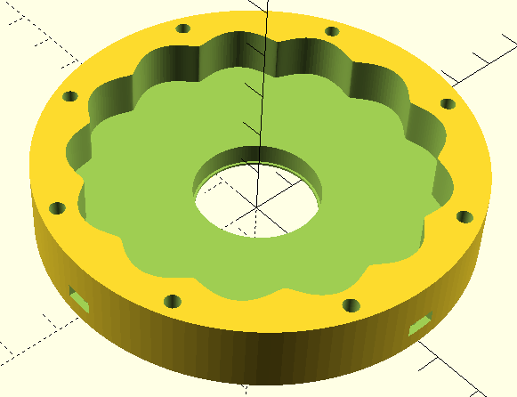

# vptc-calc
Калькулятор ВПТК (Волновой редуктор с роликами)

## Запуск

```
docker build -t vptc-calculator .
```

```
docker run --rm -it \
  -v "$(pwd)/calc-vpts.py":/app/calc-vpts.py:ro \
  -v "$(pwd)/output":/app/output \
  vptc-calculator
```

## Описание

Калькулятор генерирует 3D-модель волнового редуктора с роликами (VPTC - Variable Pace Traction Coupling) с параметрами, задаваемыми пользователем. В папку output помещается файл vptc_roller.scad который необходимо открыть в программе OpenSCAD.

## Генерируемые детали

Программа генерирует следующие основные детали:

### 1. Жёсткое колесо (Corpus редуктора) - `rigid_gear()`
- Внешний корпус редуктора с профильными впадинами
- Имеет крепёжные отверстия группы A (для крепления крышки)
- Имеет крепёжные отверстия группы B (для кожуха мотора)
- Посадочное место под подшипник 6803ZZ в корпусе

### 2. Корпус с боковым креплением - `rigid_gear_with_bracing()`
- Усиленная версия жёсткого колеса с дополнительными элементами бокового крепления
- Предназначена для крепления нагрузки

### 3. Сепаратор - `separator()`
- Держатель роликов с фланцем под основной подшипник
- Имеет посадочное место под подшипник 688ZZ (8x16x5) на конце
- Содержит отверстия для роликов
- Имеет крепёжные отверстия для нагрузки

### 4. Ролики - `rollers()`
- Цилиндрические ролики, размещаемые в сепараторе
- Количество определяется передаточным числом

### 5. Эксцентрик - `eccentric()`
- Эксцентриковая деталь, обеспечивающая волновую передачу
- Имеет посадочное место под подшипник 6803ZZ

### 6. Вал эксцентрика - `eccentric_shaft()`
- Основной вал с эксцентриковой ступенью
- Содержит посадочные места под подшипники
- Имеет шип для крепления сепаратора

### 7. Крышка редуктора - `cap()`
- Крышка корпуса с отверстиями для крепления
- Потайные отверстия под винты М3

### 8. Крышка с боковым креплением - `cap_with_bracing()`
- Усиленная версия крышки с элементами бокового крепления

### 9. Защитный кожух мотора - `motor_cover()`
- Защитный кожух для двигателя с креплением
- Имеет отверстия для крепления двигателя
- Центральное отверстие под магнит энкодера

### 10. Соединитель редукторов - `reducer_connector()`
- Элемент для соединения нескольких редукторов

### 11. Зажим соединителей - `connector_clamp()`
- Крепежный элемент для соединителей

## Управление сборкой

Внизу, в секции "Сборка", перечисляются детали, можно их создание раскомментировать и подвигать функцией translate:

```
// === Сборка ===
rigid_gear_with_bracing();  // Корпус с боковым креплением
translate([0, 0, h_reducer+1]) cap_with_bracing();  // Крышка с боковым креплением
translate([0, 0, 0.5]) eccentric_shaft();
translate([0, 0, 14]) rotate([180,0,0]) eccentric();
translate([0, 0, ecc_shaft_h1 + ecc_spacer_h-1]) separator();
translate([0, 0, -mc_total_height-1]) motor_cover(); // кожух снизу
```

## Параметры моделирования

Параметр $fn отвечает за разрешение геометрии модели:
```
// ВПТК редуктор с роликами

$fn = 60;  // Рекомендуемое значение для 3D печати
```

В редакторе OpenSCAD есть кнопки рендеринга и экспорт в STL.

## Параметры, запрашиваемые при запуске

- **Количество точек построения профиля жесткого колеса** (по умолчанию: 600) - влияет на точность профиля
- **Передаточное число** (по умолчанию: 19) - основной параметр передачи
- **Диаметр роликов (мм)** (по умолчанию: 4.0) - диаметр роликов сепаратора
- **Высота роликов (мм)** (по умолчанию: 5.0) - высота роликов сепаратора
- **Внешний радиус впадин жесткого колеса (мм)** (по умолчанию: 29.0) - радиус профиля жесткого колеса
- **Внешний диаметр редуктора (мм)** (по умолчанию: 70.0) - общий диаметр корпуса

## Список деталей и крепежа

Программа автоматически выводит список всех необходимых деталей и крепежа, включая:
- Подшипники: 6803ZZ (17×26×5 мм), 688ZZ (8×16×5 мм), и подшипник для сепаратора (6808-2RS или 6810-2RS)
- Винты: M3×10 мм и M3×15 мм
- Гайки: M3


